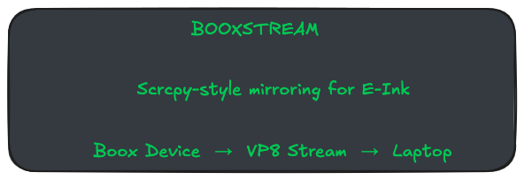

# BooxStream

<p align="center">

</p>

<p align="center">

[](https://github.com/piyushdaiya/booxstream/actions/workflows/ci.yml)

[](LICENSE)
[](https://github.com/piyushdaiya/booxstream/releases)


</p>

<p align="center">

**Scrcpy-style screen mirroring optimized for Boox e-ink devices**

</p>

<p align="center">


</p>

---

# Overview

**BooxStream** is a lightweight screen mirroring system designed specifically for **Boox e-ink devices**.

It works similarly to **scrcpy**, but focuses on the unique constraints of **e-ink displays**:

- low refresh rates
- reduced motion artifacts
- minimal CPU usage
- stable encoding on vendor Android builds

BooxStream consists of two components:

```
Android App (BooxStream APK)
Host Client (booxcpy CLI)
```

The Android app captures the screen via **MediaProjection**, encodes it using **VP8**, and streams the video through **ADB port forwarding**.

The host tool (**booxcpy**) receives the stream and can:

- display the screen
- record the stream
- pipe the stream to external tools

---

# Demo

<p align="center">

</p>

---

# Installation

Download the latest release from:

https://github.com/piyushdaiya/booxstream/releases

## Host Binary

| Platform | Download |
|--------|--------|
| Linux x64 | `booxcpy-linux-amd64.tar.gz` |
| macOS x64 | `booxcpy-darwin-amd64.tar.gz` |
| Windows x64 | `booxcpy-windows-amd64.zip` |

Extract and place the binary somewhere in your `PATH`.

Example:

```bash
tar -xzf booxcpy-linux-amd64.tar.gz
sudo mv booxcpy /usr/local/bin/
```

---

## Install Android App

Install the APK using adb:

```bash
adb install -r BooxStream-<version>-debug.apk
```

---

# Quick Start

Connect your Boox device via USB and run:

```bash
booxcpy
```

The device will prompt:

```
Start capturing?
```

Tap **Start now**.

Your Boox screen should appear instantly.

---

# Recording

Record the screen to a file:

```bash
booxcpy --record
```

Example output:

```
booxstream_20260304_171200.ivf
```

Custom filename:

```bash
booxcpy --record lecture.ivf
```

---

# Command Line Options

```
booxcpy --help
```

Common options:

```
--record [file]     record stream
--fps 12            override fps
--bitrate 900000    override bitrate
--size 1280x720     override resolution
--serial DEVICE     choose adb device
--no-play           record only
```

---

# Architecture

```
┌────────────────────────────┐
│        Host Computer       │
│                            │
│  booxcpy (Go CLI)          │
│                            │
│  • launches Android app    │
│  • sets adb forward        │
│  • reads VP8 stream        │
│  • displays / records      │
│                            │
└──────────────┬─────────────┘
               │
               │ adb forward
               │ tcp:27183
               ▼
┌────────────────────────────┐
│        Boox Device         │
│                            │
│  BooxStream APK            │
│                            │
│  MediaProjection           │
│        │                   │
│        ▼                   │
│    VP8 Encoder             │
│        │                   │
│        ▼                   │
│ IVF video stream           │
│ localabstract:             │
│ booxstream_ivf             │
│                            │
└────────────────────────────┘
```

Detailed architecture:

```
docs/ARCHITECTURE.md
```

---

# Screenshots

### Mirroring

<p align="center">

</p>

### Android UI

<p align="center">

</p>

---

# Debugging the Stream

Developers can inspect the raw stream manually.

```
adb forward --remove tcp:27183 2>/dev/null
adb forward tcp:27183 localabstract:booxstream_ivf
```

Then play with ffplay:

```
ffplay \
  -fflags nobuffer \
  -flags low_delay \
  -framedrop \
  -f ivf \
  -i tcp://127.0.0.1:27183
```

---

# Build from Source

## Android

```
cd android
./gradlew :app:assembleDebug
```

APK output:

```
android/app/build/outputs/apk/debug/
```

---

## Host

```
cd host/booxcpy
go build
```

---

# Device Compatibility

Primary target:

```
Boox e-ink devices
```

Tested on:

```
Boox Leaf 3C
```

Likely compatible:

- Android e-ink tablets
- Android e-ink phones

Not compatible:

```
Kobo readers
non-Android e-ink devices
```

---

# Security

BooxStream communicates through **ADB port forwarding**.

The forwarded port is bound to:

```
127.0.0.1
```

No external network services are exposed.

See:

```
SECURITY.md
```

---

# Contributing

Contributions are welcome.

Please read:

```
CONTRIBUTING.md
CODE_OF_CONDUCT.md
```

---

# License

Licensed under the **Apache License 2.0**.

See:

```
LICENSE
NOTICE
```

---

# Author

Piyush Daiya

GitHub:

```
https://github.com/piyushdaiya
```

---

# Inspiration

BooxStream is inspired by:

```
scrcpy
```

by Genymobile.

The project adapts the same philosophy specifically for **e-ink devices**.